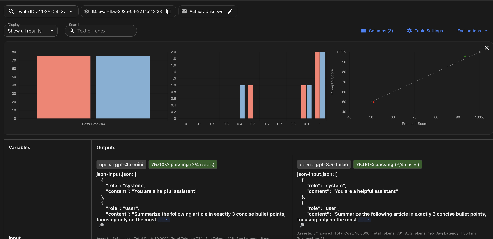

# Promptfoo
The official documentation can be found [Here](https://www.promptfoo.dev/)

## Input support

Promptfoo has many supported dataset format that can be used for the evaluation

### Raw - [Documentation](https://www.promptfoo.dev/docs/configuration/parameters/#prompts-from-raw-text)
This is the default format which imitate how human interact with LLM, we give a prompt and the input and then set the scorer

[View sample](default.yaml)

**How to run**
```bash
make raw
```

### JSON - [Documentation](https://www.promptfoo.dev/docs/configuration/parameters/#prompts-as-json)
Promptfoo support OpenAI message format in JSON. It can be used as prompt by storing it into a file an then reference it in yaml configuration file

In this scenario, we will compare 2 models
- openai gpt-4o mini
- openai gpt-3.5-turbo

And we will apply different assertion for each testcases

1. Case 1 - Similarity
2. Case 2 - LLM rubric
3. Case 3 - Answer relevance
4. Case 4 - Factuality

[View sample](json.yaml)

**How to run**
```bash
make json
```

## Assertion - [Documentation](https://www.promptfoo.dev/docs/configuration/expected-outputs/#assertion-types)

Assertion can be done using several methods. Promptfoo supports both 
**traditional assertion**
- equals
- contains
- regex 
- startwith

**Or model-assisted assertion** 
- similarity
- classifier
- rubric
- Context based eval (Useful for RAG)

# Summary
- Support various type of input
- Able to evaluate any models
- Has many evaluation methods both traditional and model-assisted

# Screenshots

## Assertion using relevance with threshold 0.7


## Multi models comparison

